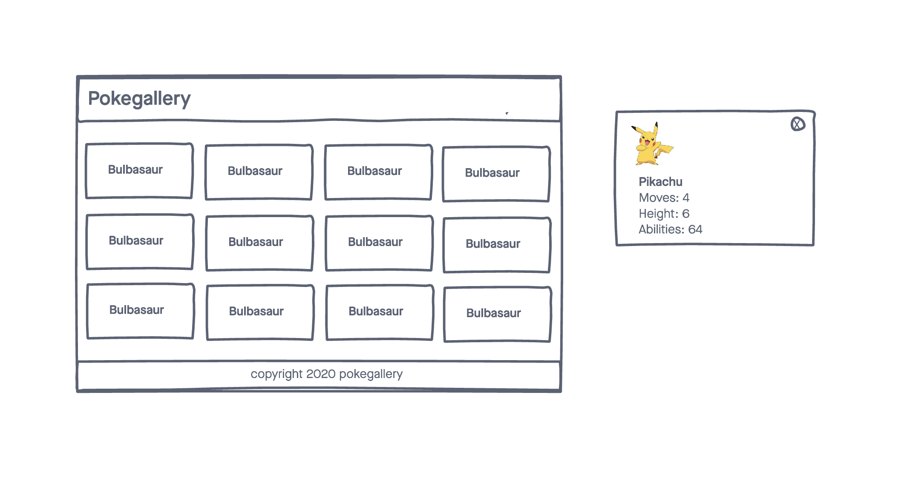

# PokeGallery

A simple web application that displays pokemon data using the pokemon API.

## Technologies Used

- HTML5
- CSS3
- Javascript
- jQuery
- Google Fonts
- jQuery Modal
- Pokemon API

## Screenshots

## Getting Started
[Click Here](https://jlong4223.github.io/PokeGallery/) to see the deployed app!

## Future Enhancements
- the ability to favorite and save pokemon to localestorage